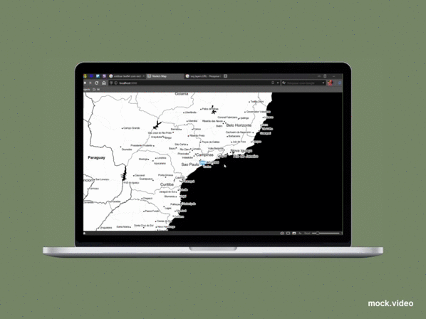
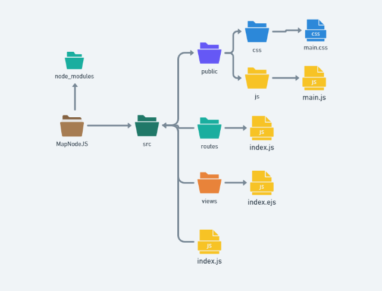

<h1 align="center">Contele International Project</h1>

  <a href="#-tecnologias">Tecnologias</a>&nbsp;&nbsp;&nbsp;|&nbsp;&nbsp;&nbsp;
  <a href="#-projeto">Projeto</a>&nbsp;&nbsp;&nbsp;|&nbsp;&nbsp;&nbsp;
  <a href="#-como-executar">Como executar</a>&nbsp;&nbsp;&nbsp;|&nbsp;&nbsp;&nbsp;
  <a href="#-licença">Licença</a>

 

  

 

  

 

## ⚙ Tecnologias

Esse projeto foi desenvolvido com as seguintes tecnologias:

- [NodeJS](https://nodejs.org/en/)
- [Javascript](https://developer.mozilla.org/pt-BR/docs/Web/JavaScript)
- [Leaflet API](https://leafletjs.com)

## 💻 Projeto

Sistema desenvolvido para um desafio da empresa CONTELE onde o objetivo proposto foi "Desenvolver uma página bem simples onde devemos ter um mapa com 50 mil marcadores e clusterizar os mesmos",foi implementado um JSON fornecido pela empresa para plotar os markes no mapa e utilizado a API LEAFLET, como base do projeto foi utilizado o Nodejs que pode ser definido como ambiente de execução Javascript server-side ou seja é possível criar aplicações Javascript para rodar como uma aplicação standalone em uma máquina, não dependendo de um browser para a execução.
  

## ⏩ Processo de criação
Como forma de boas praticas e para organização do sistema o mesmo foi separado em diversas pastas para que ficassem distribuidas de acordo com suas funções.

  

 

1.Pasta (node_module) é onde se encontra todos os pacotes externos a serem utilizados.

2.Na pasta (public) temos duas pastas uma onde esta o css do mapa que guarda toda a estilização do mesmo e dos marcadores, temos a pasta (js) onde se encontra o main.js que é onde temos a importação do JSON e toda logica aplicada no mapa.

3.Ja na (routes) temos literalmente a rota de onde ira ser renderezado o sistema.

4.E enfim temos a pasta (views) onde se encontra o index.ejs que é o arquivo onde temos o html da pagina que no mesmo tem a importação dos links uteis para o mapa como a clusterização de seus markers a div onde indexamos o mapa e o script main que é onde esta a logica por tras.

5.Também temos o arquivo "index.js" que é o arquivo onde setamos os requires e o servidor que se encontra na porta 3000.

## 🌌 Como executar

- Clone o repositório
- Baixe o NodeJS - [NodeJS](https://nodejs.org/en/)
- Inicie o servidor local atraves do "npm run dev"

Agora você pode acessar [`localhost`](http://localhost:3000) do seu navegador.

## 🌌 Conclusão
Primeiramente agradeço pela oportunidade que não nego mesmo que foi uma oportunidade incrivel que me fez ter mais certeza que estou no caminho certo, com esse objetivo a cada minuto estava aprendendo conteudos novos e passando por mais uma barreira que eu estava enfrentando em cada tarefa que deveria ser executada, o aprendizado oi incrivel e segue constante com essa tecnologia que esta na linha de frente das tecnologias utilizadas no mercado essa expêriencia unica so me proporcionou mais motivação. Estou a disposição para receber comentarios, dicas e melhorias des de ja obrigado!

## 📄 Licença

Esse projeto está sob a licença MIT. Veja o arquivo [LICENSE](LICENSE.md) para mais detalhes.

---

### Autor

 

 <b>Carlos Vinicius</b></a> <a href="">🚀</a>
 

Feito com ❤️ por Carlos Vinicius 👋🏽 Entre em contato!

 

